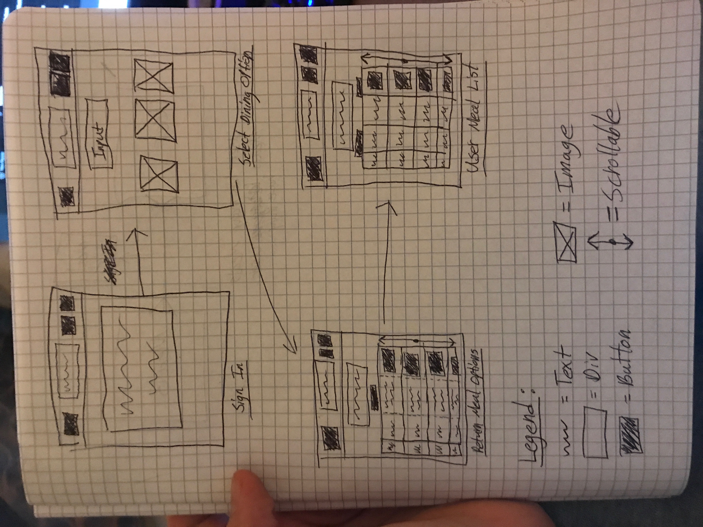
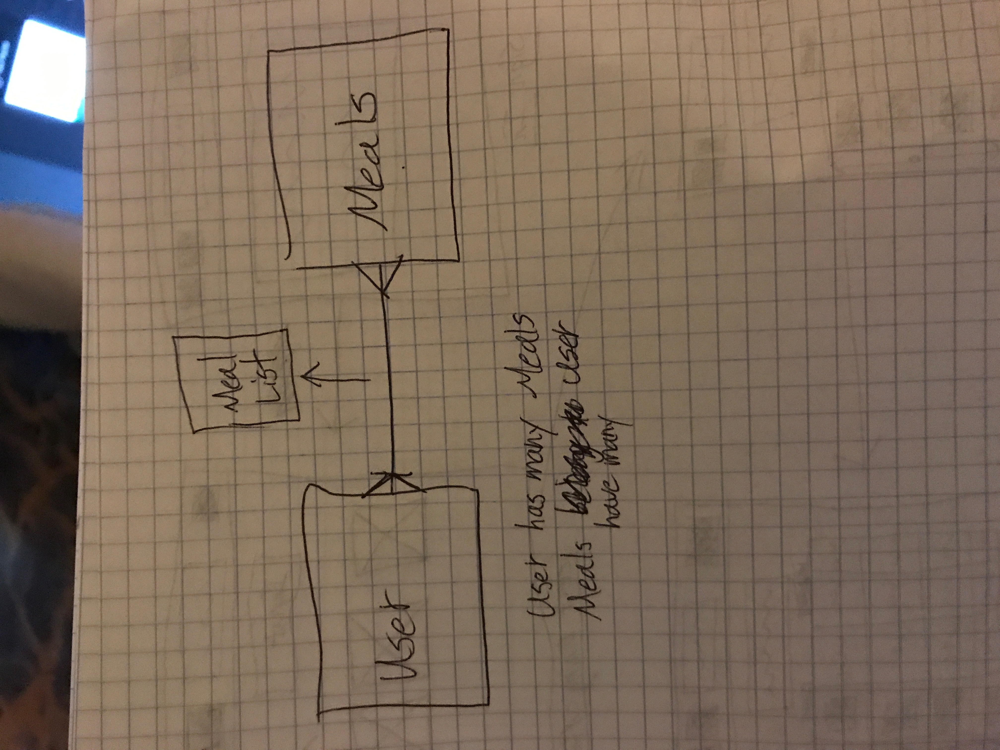
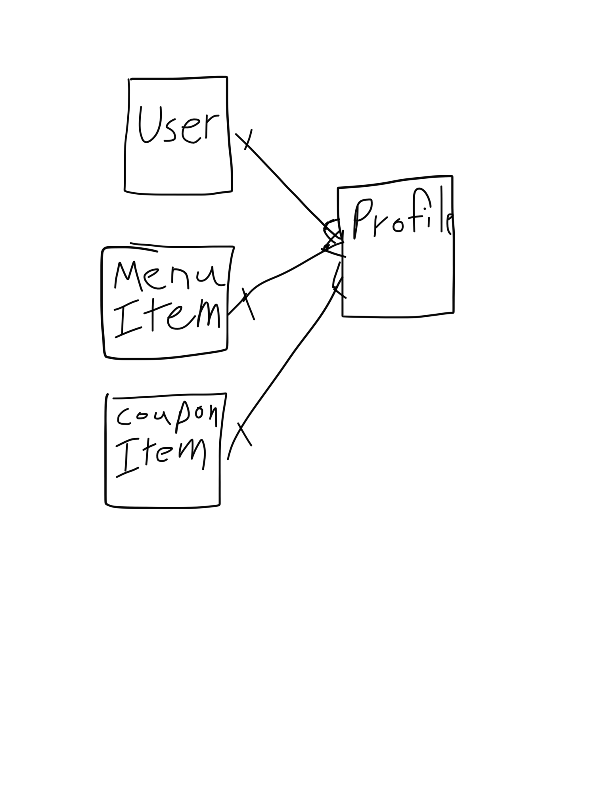

# Tic Tac Toe
### By Sam Dyer
#### In Association With General Assembly

Link to hosted application:
[Take-A-Bite By Sam Dyer](https://slammyde7113.github.io/take-a-bite-front-end/)

### Technologies used:

-   [Webpack](https://webpack.github.io)
-   [Bootstrap](http://getbootstrap.com)
-   [Handlebars.js](http://handlebarsjs.com)
-   [Grunt](https://gruntjs.com/)
-   [Rails](http://rubyonrails.org/)

### Project History:

Description:
  Take-A-Bite is a website that allows users to search through a menu database and pick what foods they would like to purchase before they go out. Users can input a set amount of money they would like to spend and Take-A-Bite queries the menu database to return the menu items within that price range. Users can create profiles of potential foods they would like to purchase in order to pre-plan their meals.

Initial Concept:

  

Initial Database Relationship:
  

Finished Database Relationship:
  

### Unsolved Problems:
  Wanted to implement the Google Maps API and Google Menu API but did not have sufficient time. My future plans are to add these features so that users can query real menu databases and find the locations near them.

### User Stories:
- When I enter an email and password I should see a prompt that tells me whether or not it was successful.
- When I enter my username/password I should see a prompt telling me whether or not it was successful.  Once logged in, I should see a button to see the menu and my profiles, a change password field and button, a sign out button, and a coupon button.
  - The change password field lets me change my password and the prompt tells me when its successful.
  - When I pressed the check button I see a list of my game history.
  - When I press the sign out button I see a prompt telling me it was successful and it brings me back to the sign in page.
- When I click the menu button, I should see the menu list
  - When I see a menu item, I should see an add button
- When I click the profile button, I should see a list of menu items I've selected.
  - When I look at my profile, I should see a button to remove an item from my profile.
- The coupon button should reveal an input bar where you can input the coupon code and then apply it to your profile item.
